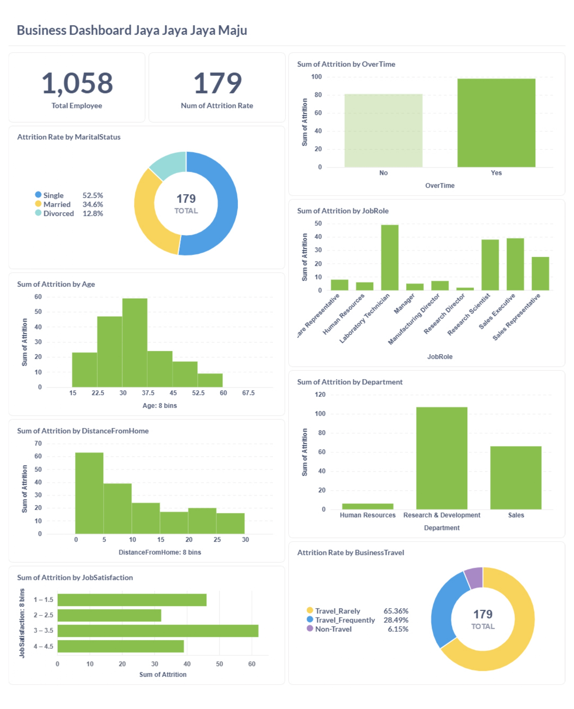

# Proyek Akhir: Menyelesaikan Permasalahan Perusahaan Edutech - Jaya Jaya Jaya Maju 

## Business Understanding

Jaya Jaya Maju merupakan salah satu perusahaan multinasional yang telah berdiri sejak tahun 2000. Perusahaan ini memiliki lebih dari 1000 karyawan yang tersebar di seluruh penjuru negeri. Walaupun telah menjadi perusahaan yang cukup besar, Jaya Jaya Maju masih menghadapi kesulitan dalam mengelola karyawan. Hal ini berdampak pada tingginya attrition rate (rasio jumlah karyawan yang keluar dibandingkan total karyawan keseluruhan) yang mencapai lebih dari 10%. Tingginya attrition rate ini mengindikasikan adanya masalah dalam mempertahankan karyawan, yang dapat berdampak negatif pada produktivitas, biaya rekrutmen, dan stabilitas operasional perusahaan.

### Permasalahan Bisnis

Perusahaan Jaya Jaya Maju menghadapi tantangan dalam pengelolaan sumber daya manusia, yang ditandai dengan meningkatnya attrition rate (rasio karyawan yang keluar dibandingkan dengan total karyawan) hingga lebih dari 10%. Tingginya tingkat attrition ini berdampak negatif terhadap stabilitas dan keberlangsungan operasional perusahaan. Oleh karena itu, proyek ini bertujuan untuk menjawab beberapa pertanyaan kunci berikut:
1. Seberapa tinggi tingkat attrition di perusahaan Jaya Jaya Maju?
2. Faktor-faktor apa saja yang memengaruhi tingginya attrition rate di perusahaan?
3. Apakah terdapat perbedaan tingkat attrition berdasarkan role atau departemen tertentu dalam perusahaan?

### Cakupan Proyek
- Analisis Data: Menggunakan data karyawan yang ada untuk mengidentifikasi faktor-faktor utama yang mempengaruhi attrition.
- Visualisasi & Pelaporan: Mengembangkan dashboard bisnis yang dapat digunakan oleh manajer HR untuk memonitor dan menganalisis faktor-faktor tersebut secara visual.
- Rekomendasi & Intervensi: Berdasarkan hasil analisis, memberikan rekomendasi untuk intervensi yang dapat dilakukan untuk mengurangi attrition rate dan meningkatkan kepuasan karyawan.

### Persiapan

Sumber data: dataset yang digunakan merupakan dataset [Jaya Jaya Maju](https://github.com/dicodingacademy/dicoding_dataset/blob/main/employee/employee_data.csv). Dataset ini adalah Dataset Karyawan Jaya Jaya Maju yang memuat berbagai informasi terkait karyawan, seperti usia, departemen, tingkat pendidikan, pendapatan bulanan, serta apakah karyawan tersebut mengalami attrition (keluar dari perusahaan) atau tidak. 

Sebelum digunakan untuk analisis, dataset telah melalui tahap pembersihan data (data cleaning) menggunakan Notebook. Setelah itu, data siap digunakan untuk proses eksplorasi, pemodelan prediktif, serta pembuatan visualisasi interaktif guna mendukung pengambilan keputusan oleh tim Human Resources (HR).

Setup environment:

* Setup conda environment:
    ```
    conda create --name proyek-human-resources python==3.9.15
    ```
* Install requirements:
    ```
    pip install -r requirements.txt
    ```
* Setup metabase:
    - Memanggil (pull) Docker image untuk menjalankan Metabase.
    ```
    docker pull metabase/metabase:v0.46.4
    ```
    - Menjalankan image.
    ```
    docker run -p 3000:3000 --name metabase metabase/metabase
    ```
    Akses metabase pada http://localhost:3000/setup dan lakukan setup.
* Setup database (supabase):

    * Siapkan env proyek untuk mengolah dataset yang akan digunakan
        ```
        pip install pandas sqlalchemy
        ```
    * Siapkan database
    * Buat akun dan login https://supabase.com/dashboard/sign-in.
    * Buat new project
    * Create a new project
    * Copy URI pada database setting, gunakan `Transaction Pooler` pada Connection String
    * Kirim dataset menggunakan sqlalchemy 
    ```python
    from sqlalchemy import create_engine
 
    URL = "DATABASE_URL"
    
    engine = create_engine(URL)
    df.to_sql('attrition', engine)
    ```
* Menjalankan File Prediksi
    Jalankan perintah berikut pada terminal yang sudah berada pada path proyek `cd path/to/destination/directory`
    - Menggunakan file python 
    ```
    python prediction.py
    ```
    - Menggunakan streamlit
    ```
    streamlit run prediction.py
    ```

## Business Dashboard

Dashboard ini bertujuan untuk membantu tim HR dalam memantau dan menganalisis tingkat employee attrition (tingkat karyawan keluar) berdasarkan berbagai variabel demografis dan organisasi. Visualisasi ini membantu manajemen dalam memahami faktor-faktor yang paling berkontribusi terhadap tingginya attrition rate, sehingga dapat dirumuskan strategi retensi karyawan yang lebih baik. Pada dashboard ini, tim HR dapat :
- Mengidentifikasi are atau departeme yang memiliki tingkat arttrition tinggi.
- Menganalisis faktor-faktor seperti lembur, kepuasan kerja, dan kelompok demografis yang mungkin mempengaruhi attrition.
- Mengambil tindakan untuk mengurangi attrition rate dan mengurangi biaya terkait dengan pergantian karyawan.




## Conclusion

Tingkat attrition di perusahaan ini kurang lebih sebesar 17%. Angka ini menunjukkan bahwa sekitar 1 dari setiap 6 karyawan keluar dari perusahaan, yang merupakan indikator cukup tinggi dan perlu dianalisis lebih lanjut. Idealnya, attrition rate yang sehat berada di bawah 10%, overtime menjadi faktor terbesar yang mempengaruhi tingginya attrition rate di perusahaan ini, karena berban kerja yang berlebih sehingga dapat menimbulkan stress, hingga merasa kurang dihargai secara kompensasi. Beberapa faktor yang mempengaruhi keputusan karyawan untuk meninggalkan perusahaan selain kerja kembur (Overtime) adalah status perkawinan, Karyawan yang belum menikah (single) menunjukkan tingkat attrition yang lebih tinggi, yang mungkin mencerminkan mobilitas yang lebih besar dan keinginan untuk mencari peluang baru. Faktor selanjutnya adalah karyawan dengan jabatan sebagai Sales Representative (JobRole_Sales Representative), posisi ini memiliki tingkat attrition tinggi karena tekanan target yang besar, ketidakpastian penghasilan, serta mobilitas dan tuntutan tinggi dari klien. Adapaun terdapat perbedaan tingkat attrition berdasarkan role dan departemen. Seperti pada role Sales Representative dan departemen seperti Sales menunjukkan tingkat attrition yang lebih tinggi dibandingkan role atau departemen lain. Hal ini menunjukkan bahwa beban kerja, tekanan, dan mungkin juga struktur kompensasi di departemen-departemen ini dapat berkontribusi pada keputusan karyawan untuk meninggalkan perusahaan.

### Rekomendasi Action Items (Optional)

Berikan beberapa rekomendasi action items yang harus dilakukan perusahaan guna menyelesaikan permasalahan atau mencapai target mereka.

1. Evaluasi dan Kurangi Beban Kerja Lembur (Overtime)
    - Lakukan audit beban kerja dan lembur di setiap divisi.
    - Terapkan batas maksimum lembur dan sistem kompensasi lembur yang adil.
    - Dorong work-life balance melalui kebijakan fleksibel atau cuti tambahan.
2. Tinjau Struktur Kompensasi dan Insentif
    - Evaluasi ulang sistem komisi dan insentif bagi setiap role dan departemen.
    - Sediakan gaji tetap yang kompetitif untuk posisi dengan risiko tinggi attrition.
    - Berikan bonus loyalitas untuk mendorong retensi jangka panjang.
3. Lakukan Survei Kepuasan Karyawan Secara Rutin
    - Ukur dan pantau faktor-faktor stres kerja, kompensasi, dan kepuasan kerja
    - Gunakan hasil survei untuk menyesuaikan kebijakan HR dan manajemen.
4. Bangun Jalur Karier yang Jelas dan Transparan
    - Tawarkan peluang promosi internal dan pelatihan keterampilan lintas fungsi.
    - Komunikasikan jenjang karier sejak awal onboarding.
5. Penilaian dan Tindakan Berkelanjutan:
    - Pantau terus faktor-faktor yang mempengaruhi attrition melalui dashboard dan lakukan tindakan cepat saat masalah mulai muncul.

Dengan mengikuti rekomendasi ini, perusahaan diharapkan dapat menurunkan tingkat attrition, meningkatkan retensi karyawan, dan memperkuat stabilitas serta efisiensi operasional secara keseluruhan.

Username: root@mail.com Password: root123
